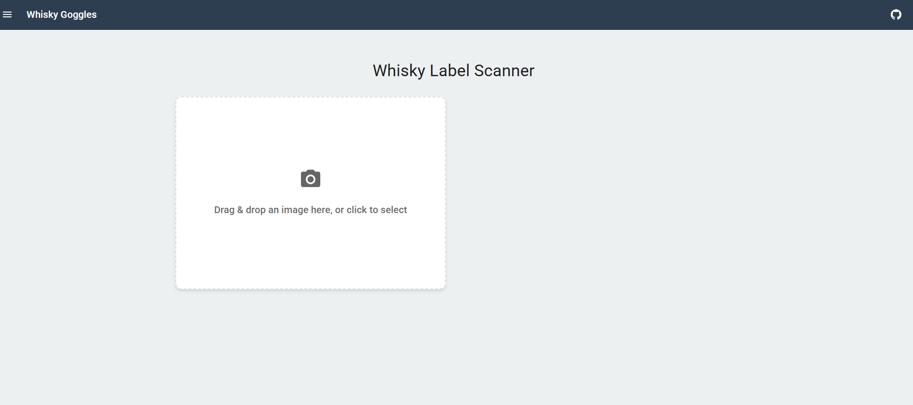
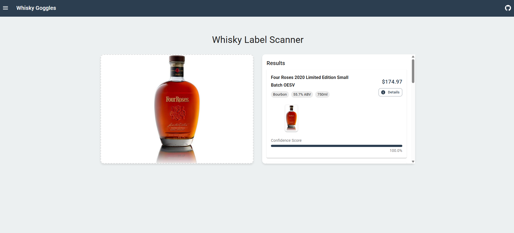
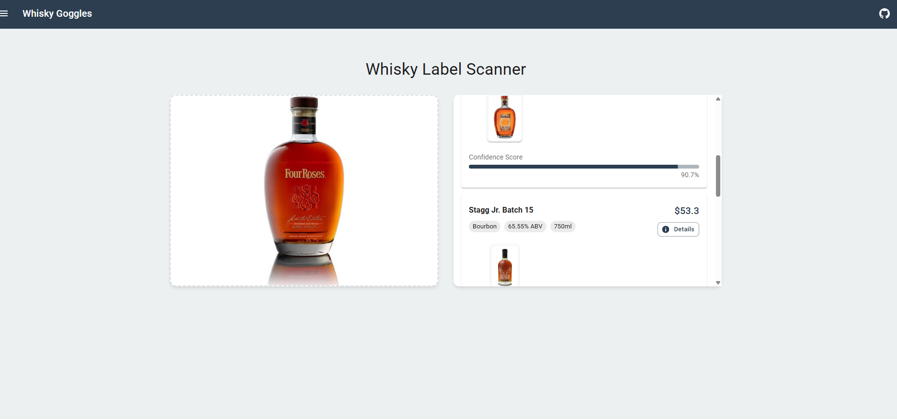

# Whisky Goggles - Whisky Bottle Label Recognition System

A computer vision system that scans whisky bottle labels and matches them to BAXUS's database of 500 bottles. This system helps users quickly identify bottles and record pricing information at liquor stores.

## Features

- Label Detection & Recognition
  - Processes images of whisky bottle labels
  - Extracts key visual features for identification
  - Matches labels to corresponding bottles in the BAXUS dataset

- Bottle Identification
  - High accuracy matching to the 500-bottle dataset
  - Handles variations in lighting, angle, and partial labels
  - Provides confidence scores for matches

## System Requirements

- Python 3.8 or higher
- CUDA-compatible GPU (recommended for optimal performance)
- Webcam or smartphone camera for image capture

## Installation

1. Clone the repository:
```bash
git clone https://github.com/yourusername/whisky-goggles.git
cd whisky-goggles
```

2. Install required dependencies:
```bash
pip install -r requirements.txt
```

3. Install Tesseract OCR:
   - Windows: Download and install from [Tesseract GitHub](https://github.com/UB-Mannheim/tesseract/wiki)
   - Linux: `sudo apt-get install tesseract-ocr`
   - macOS: `brew install tesseract`

## Dataset

The whisky bottle metadata and reference images are not included in this repository due to size and licensing. You can download the dataset from the following Google Sheets link:

[Whisky Goggles Dataset (Google Sheets)](https://docs.google.com/spreadsheets/d/1yXIJo5f00clyrFHlRyKuIwrNCQw_cNcoVbSvtKO_bTs/edit?gid=0#gid=0)

Once downloaded, place the CSV in your project directory and ensure image paths are correct for your local setup.

## Usage

### Backend (API Server)

1. Start the FastAPI server:
```bash
python server.py
```

The server will launch the API for whisky label recognition. Make sure all dependencies are installed (see Troubleshooting if you encounter errors).

### Frontend (Web App)

2. Install Node.js dependencies (if not already done):
```bash
npm install
```

3. Start the Vite development server:
```bash
npm run dev
```

The frontend will be available at [http://localhost:5173](http://localhost:5173).

### Image Recognition Flow

- Point your camera at a whisky bottle label or upload an image.
- The system will process the image and display:
  - Matched bottle information
  - Confidence score
  - Price comparison with MSRP

## How It Works

- **Upload an image** of a whisky bottle label using the web app.
- The backend processes the image using computer vision and OCR (Tesseract), matches it to the closest bottles in the dataset, and returns structured results.
- The frontend displays the top matches, including bottle images, names, types, ABV, MSRP, and confidence scores.

## Project Structure

- `server.py` - FastAPI backend for recognition API
- `whisky_recognition.py` - Core recognition logic (deep features, OCR, matching)
- `public/images/` - Local image assets for bottle matching
- `src/` - React frontend code (see `components/WhiskyScanner.jsx`)
- `501 Bottle Dataset - Sheet1 (local images).csv` - Bottle metadata and image references

## Troubleshooting

- **Internal Server Error (500):** Ensure all dependencies are installed and Tesseract OCR is available in your PATH.
- **Frontend/Backend Connection:** The API endpoint is set to `http://localhost:8888/api/recognize` in `src/api/whiskyRecognition.js`. Make sure the backend is running on this port.
- **Image Not Displaying:** Ensure images referenced in the CSV are present in `public/images/` with matching filenames.
- **Missing Python Packages**
   - If you see `ModuleNotFoundError`, ensure you are using the correct Python environment and run:
     ```bash
     python -m pip install -r requirements.txt
     ```
   - For persistent issues, check your `python` and `pip` paths:
     ```bash
     where python
     where pip
     ```
- **Poor Recognition Results**
   - Ensure good lighting conditions
   - Keep the label clearly visible and centered
   - Minimize glare and reflections
- **Performance Issues**
   - Check GPU availability and CUDA installation
   - Close other resource-intensive applications
   - Update graphics drivers
- **Installation Problems**
   - Verify Python version compatibility
   - Check Tesseract OCR installation
   - Ensure all dependencies are properly installed

## Demo

Here are screenshots demonstrating the Whisky Goggles workflow:

### 1. Project Structure & Requirements


### 2. Initial UI - Ready to Scan


### 3. File Upload Dialog


### 4. Successful Recognition (Single Result)


### 5. Successful Recognition (Multiple Results)


### 6. Another Example Recognition


1. Start the backend (`python server.py` or `uvicorn server:app --host 127.0.0.1 --port 8888 --reload`).
2. Start the frontend (`npm run dev`).
3. Visit [http://localhost:5173](http://localhost:5173), upload a whisky label image, and view the recognition results.

## Contributing

Contributions are welcome! Please feel free to submit a Pull Request.

## License

This project is licensed under the MIT License - see the LICENSE file for details.

**Contributors:**
- Prashant Kandel

**Contact:**
- prashantkandel55@gmail.com

---

Enjoy using Whisky Goggles for fast and accurate whisky bottle identification!
