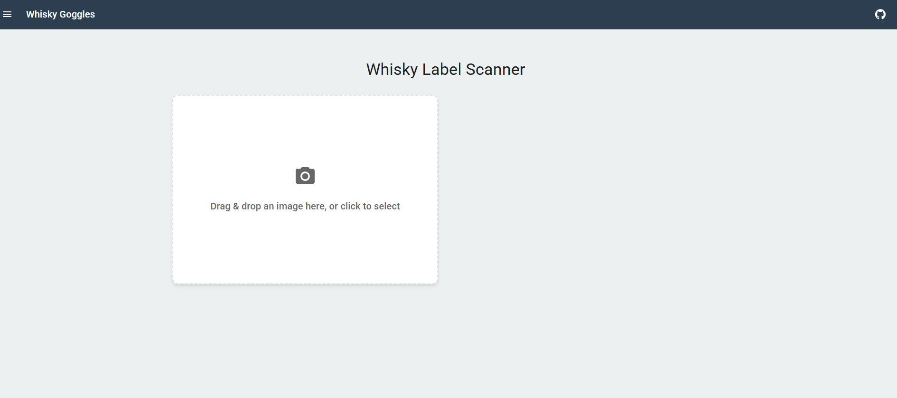
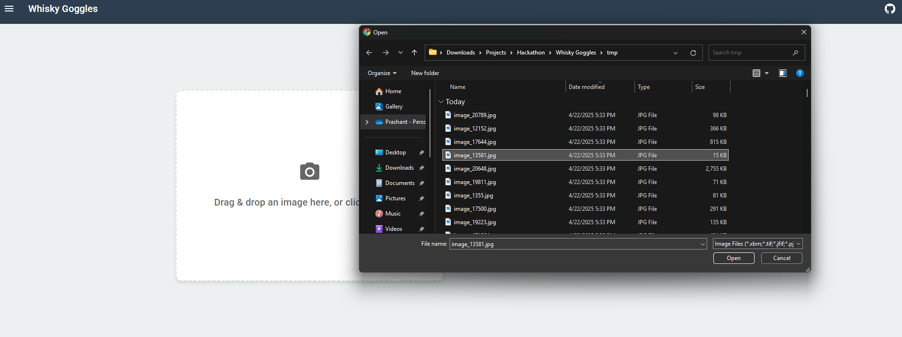
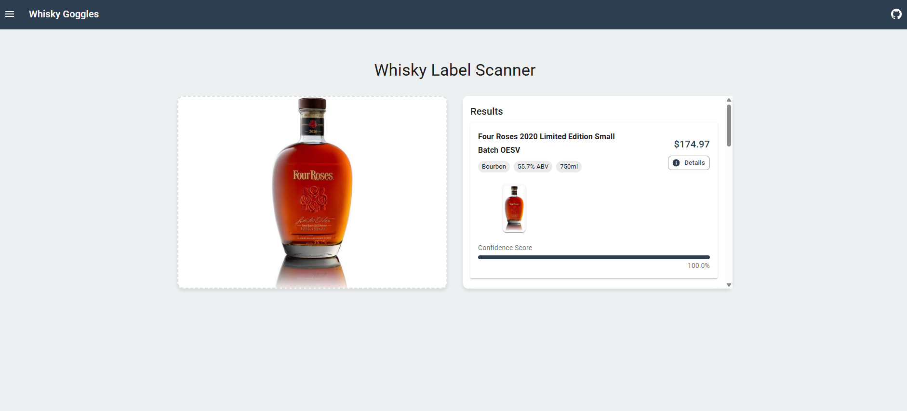
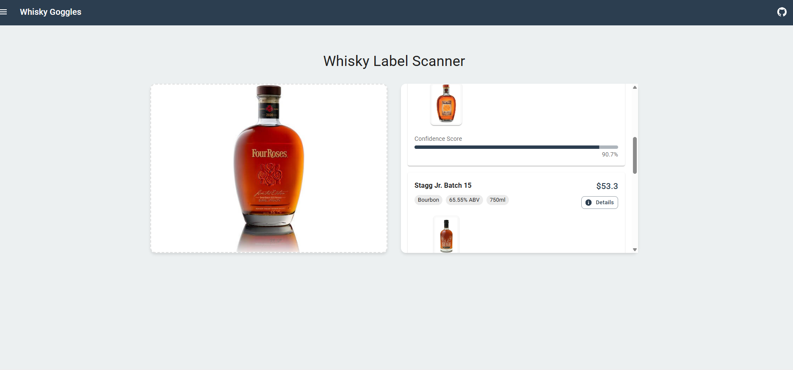

# Whisky Goggles Demo Screenshots

Below are screenshots demonstrating the full workflow of the Whisky Goggles application:

---

### 1. Error Handling (Missing Import)


---

### 2. Initial UI - Ready to Scan


---

### 3. File Upload Dialog


---

### 4. Successful Recognition (Single Result)


---

### 5. Successful Recognition (Multiple Results)


---

## How to Add These Images to README.md

1. Save the above images to a `screenshots/` folder in your project root.
2. Reference them in your `README.md` using the following markdown:
   ```md
   
   ```
3. Example:
   ```md
   
   ```

---

## Next Step

Would you like me to automatically update your README.md with these images and captions? If so, please confirm the images are saved in the correct `screenshots/` folder or provide the actual file paths.
